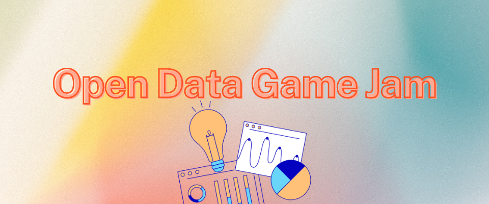
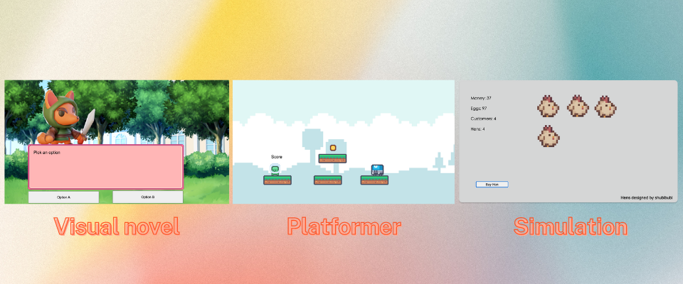

## Table of contents
- [Why a game jam with open data?](#why-a-game-jam-with-open-data)
- [Expected learning outcomes](#expected-learning-outcomes)
- [Materials needed](#materials-needed)
- [Agenda](#agenda)
- [Tutorials](#tutorials)
- [Credits](#credits)
- [Acknowledgements](#acknowledgements)
## Why a game jam with open data?
Open data hackathons are a popular approach to incentivize the reuse of open datasets. Open data hackathons are great, you get to meet a lot of people with similar interests, and you get to build something together. The solutions developed at hackathons rarely go beyond the prototype stage, but the value of hackathons is bringing people together. Still, hackathons have been criticized for being “solutionist”. Social issues are often simplified in order to justify simple technological interventions. But not all problems can be fixed with technology. Having game jam lets us change the invitation to participants from “fixing” social issues to “expressing” social issues through games.

## Expected learning outcomes
**Computer programming skills.** The workshop includes an introduction to Construct 3, a web-based game engine which relies on visual coding. Visual coding lets users write instructions visually rather than textually and is easier to learn. Visual coding in Construct 3 relies on the same basic concepts of text-based programming. Learners are introduced to functions, event logic, scope, and other basic programming concepts.

**Teamwork.** Participants work in teams and need to wear different hats (programmer, artist, game designer, etc.) and combine their skills to produce the game, therefore challenging their teamwork abilities. The workshop also includes basic teambuilding exercises to break the ice and let participants feel comfortable within their team.

**Knowledge related to a societal issue.** Participants are invited to produce games which expresses a social issue (examples given for inspiration are https://playspent.org/, https://www.molleindustria.org/mcdonalds/). Participants are invited to explore pre-digested datasets on the societal issue (such as data-driven journalistic investigations, data visualizations, etc.). While collaboratively designing the game mechanics and content, we expect participants to discuss the social issue they are addressing and learn more about it.

## Materials needed
- 20-45 participants available from 9:30AM to 5PM
- Two people, a facilitator, and an assistant
- Individual laptops with a good internet connection, able to visit editor.construct.net (corporate firewalls sometimes block the connection)
- Basic stationery materials (tables, whiteboard, markers, post-its)
- Large screen to show a presentation
- Possibility to distribute anonymous surveys at the beginning and end of the session

### Icebreakers
#### Human Bingo
For this icebreaker, you need to print and distribute one [bingo card](/materials/human_bingo.pdf) per participant. These are the rules:
- Find people who match the statements on this card.
- When you 
find a match, that person signs the corresponding square.
- Fill a row (horizontally, vertically, or diagonally).
You can have maximum 2 signatures from the same person on your card

### Brainstorming
Brainstorming sheets include:
- [Issue pitch sheet](/materials/issue_pitch.pdf)
- [Game design doc](/materials/game_doc.pdf)
- [Inspiration sheet](/materials/inspiration.pdf)
- [Screenshots sheet](/materials/screenshots_drawing.pdf)

### Other materials
- [Event badges](/materials/badges.pdf)
- [Roles stickers](/materials/roles.pdf)
- [Points](/materials/points.pdf)

## Agenda
| Time  | Activity                                                     |
|-------|--------------------------------------------------------------|
| 9:30  | Pre-workshop survey                                          |
| 9:40  | Introductory presentation                                    |
| 9:50  | Icebreaker                                                   |
| 10:00 | Reflection on your skills                                    |
| 10:15 | Brainstorm ideas for an issue to address, walk around freely |
| 11:00 | Pitches                                                      |
| 11:30 | Join a team                                                  |
| 11:45 | Icebreaker                                                   |
| 12:00 | Construct 3 demo                                             |
| 12:30 | Lunch                                                        |
| 13:45 | Game-making                                                  |
| 14:45 | Break                                                        |
| 14:55 | Icebreaker                                                   |
| 15:05 | Game-making                                                  |
| 16:20 | Play each otherʼs games                                      |
| 16:40 | Announce winners                                             |
| 16:45 | Post-workshop survey                                         |
| 17:00 | The end                                                      |

## Tutorials

There are three beginner level Construct 3 tutorials. The tutorials are not meant to show best-practices, but rather how to make quickly make a prototype. The tutorials are made for teams of 4 people. Each tutorial requires a different team composition. Each tutorial also contains a link to the finished project.
- [Visual novel](/tutorials/visual-novel.md)
- [Platformer](/tutorials/platformer.md)
- [Simulation](/tutorials/simulation.md)

## Credits
Davide Di Staso, TU Delft, Faculty of Technology, Policy and Management

## Acknowledgements
Special thanks to Lærke Christiansen (TU Delft, Faculty of Technology, Policy and Management) for observing the pilot workshops and providing feedback and ideas. Thanks to Fernando Kleiman and Marijn Janssen (TU Delft, Faculty of Technology, Policy and Management) for their guidance and support in developing this toolkit.

This project has received funding from the European Union’s Horizon 2020 research and innovation programme under the Marie Skłodowska-Curie grant agreement No 955569. The opinions expressed in this document reflect only the author’s view and in no way reflect the European Commission’s opinions. The European Commission is not responsible for any use that may be made of the information it contains. 
